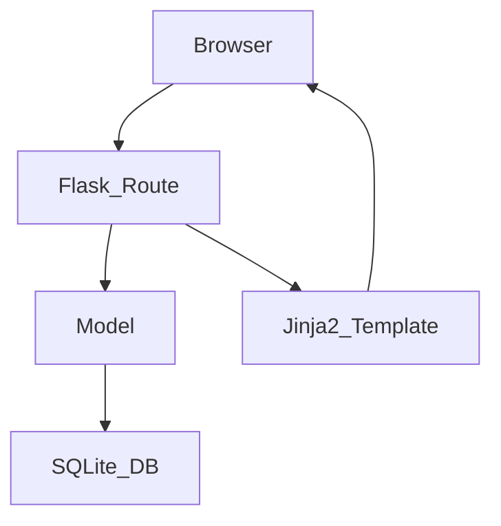

# ARCHITECTURE - 個人記帳簿系統

## 1. 技術架構說明
- **後端框架**: Python + Flask – 輕量且易於快速開發，適合小型個人應用。
- **模板引擎**: Jinja2 – 在 Flask 中直接渲染 HTML，提供伺服器端渲染，避免前後端分離的複雜度。
- **資料庫**: SQLite (使用 `sqlite3` 或 SQLAlchemy) – 零設定、檔案即資料庫，適合單使用者本機儲存。
- **靜態資源**: CSS/JS 直接放在 `static/`，由 Flask 服務。
- **部署**: 直接在本機執行 `flask run`，未使用容器或 CI/CD，保持簡單。

### 為何選用這些技術
| 技術 | 原因 |
|------|------|
| Flask | 小型專案快速上手、路由與模板整合便利 |
| Jinja2 | 與 Flask 原生相容，減少前端框架負擔 |
| SQLite | 本地單檔案資料庫，免安裝額外服務 |
| Python 3.12+ | 現代語法、廣泛套件支援 |

## 2. 專案資料夾結構
```
personal_bookkeeping/
│   app.py               # 入口程式，建立 Flask app
│   requirements.txt      # 依賴套件列舉
│
├─ app/                    # 主要程式碼區域
│   ├─ __init__.py        # 套件初始化，建立 db 連線等
│   ├─ models/            # 資料庫模型 (SQLAlchemy 或 raw sqlite3) 
│   │   └─ transaction.py
│   ├─ routes/             # Flask 路由（Controller）
│   │   ├─ __init__.py
│   │   ├─ ledger.py       # 記帳、查詢、匯出等功能路由
│   │   └─ budget.py      # 預算管理相關路由
│   ├─ templates/          # Jinja2 HTML（View）
│   │   ├─ base.html
│   │   ├─ ledger.html
│   │   └─ budget.html
│   └─ static/             # CSS / JS / 圖片
│       ├─ css/
│       │   └─ style.css
│       └─ js/
│           └─ main.js
│
├─ instance/                # Flask instance folder（可放資料庫）
│   └─ database.db        # SQLite 檔案（gitignore）
│
└─ docs/                   # 文件（PRD、ARCHITECTURE）
    ├─ PRD.md
    └─ ARCHITECTURE.md    # 本文件
```

## 3. 元件關係圖 (Mermaid)


## 4. 關鍵設計決策
1. **單檔案 SQLite** – 簡化部署與備份，適合個人使用者。
2. **Flask MVC** – 以「模型-路由-模板」分層，保持程式碼可維護性。
3. **不使用前端框架** – 透過 Jinja2 直接生成 HTML，減少複雜度與學習成本。
4. **資料夾分離** – `models/`, `routes/`, `templates/`, `static/` 各司其職，利於未來功能擴充（如圖表、報表）。
5. **配置檔分離** – `instance/database.db` 放在 `instance/`，並在 `.gitignore` 中排除，保障資料安全。

---
*此文件使用繁體中文撰寫，適合初學者閱讀。*
