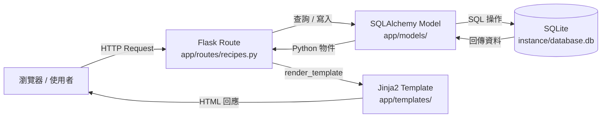
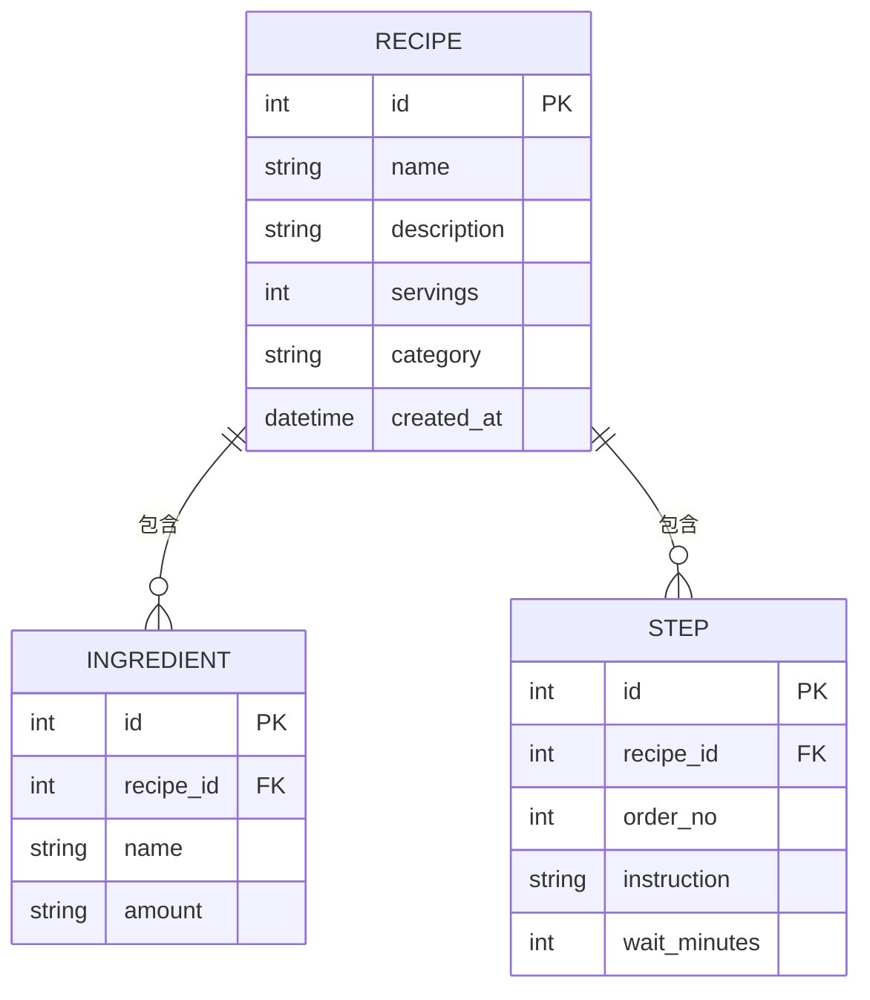

# 系統架構文件 - 食譜收藏夾

## 1. 技術架構說明

### 選用技術與原因

| 技術 | 角色 | 選用原因 |
|------|------|----------|
| **Python + Flask** | 後端 Web 框架 | 輕量、易學，適合中小型 Web 應用，路由設計直覺清楚 |
| **Jinja2** | 模板引擎（View） | Flask 原生整合，語法簡單，讓 HTML 可嵌入動態資料 |
| **SQLite** | 資料庫 | 無需安裝伺服器，單一 `.db` 檔案，適合練習與小型應用 |
| **SQLAlchemy** | ORM 工具 | 以 Python 物件操作資料庫，減少手寫 SQL 的錯誤風險 |
| **CSS (Vanilla)** | 前端樣式 | 無框架依賴，方便初學者理解與自訂 |

### Flask MVC 模式說明

本專案採用 **MVC（Model-View-Controller）** 架構模式：

| 層次 | 對應元件 | 職責 |
|------|----------|------|
| **Model** | `app/models/` | 定義資料結構（食譜、材料、步驟），負責與 SQLite 資料庫溝通 |
| **View** | `app/templates/` | Jinja2 HTML 模板，負責呈現資料給使用者 |
| **Controller** | `app/routes/` | Flask 路由，接收 HTTP Request，呼叫 Model 取得資料，再回傳 View |

---

## 2. 專案資料夾結構

```
web_app_development/
│
├── app/                        ← 主要應用程式套件
│   ├── __init__.py             ← 建立 Flask app 實例，初始化資料庫
│   │
│   ├── models/                 ← Model 層：資料庫模型定義
│   │   ├── __init__.py
│   │   ├── recipe.py           ← 食譜 (Recipe) 資料模型
│   │   ├── ingredient.py       ← 材料 (Ingredient) 資料模型
│   │   └── step.py             ← 步驟 (Step) 資料模型（含等待時間）
│   │
│   ├── routes/                 ← Controller 層：Flask 路由（藍圖）
│   │   ├── __init__.py
│   │   └── recipes.py          ← 食譜相關路由（列表、新增、詳細、編輯、刪除）
│   │
│   ├── templates/              ← View 層：Jinja2 HTML 模板
│   │   ├── base.html           ← 共用版型（導覽列、頁尾）
│   │   ├── index.html          ← 首頁：食譜列表
│   │   ├── recipe_detail.html  ← 食譜詳細頁：材料 + 步驟（含等待時間）
│   │   ├── recipe_form.html    ← 新增 / 編輯食譜表單
│   │   └── recipe_confirm_delete.html ← 刪除確認頁
│   │
│   └── static/                 ← 靜態資源
│       ├── css/
│       │   └── style.css       ← 全站樣式
│       └── js/
│           └── main.js         ← 前端互動（選填，例如等待時間計時器）
│
├── instance/
│   └── database.db             ← SQLite 資料庫檔案（執行後自動產生）
│
├── docs/                       ← 文件資料夾
│   ├── PRD.md                  ← 產品需求文件
│   └── ARCHITECTURE.md         ← 本文件
│
├── app.py                      ← 入口檔案：啟動 Flask 應用
└── requirements.txt            ← Python 套件依賴清單
```

---

## 3. 元件關係圖

### 請求／回應流程



### 模型關聯



---

## 4. 關鍵設計決策

### 決策 1：使用 Flask Blueprint 組織路由

- **做法**：將所有食譜相關路由集中在 `app/routes/recipes.py`，以 Blueprint 方式註冊
- **原因**：當功能擴增（例如之後加入使用者系統）時，不同功能的路由可分開管理，避免 `app.py` 越來越龐大

### 決策 2：Step 模型獨立儲存等待時間欄位

- **做法**：`Step` 資料表有獨立的 `wait_minutes` 欄位（整數，單位：分鐘）
- **原因**：這是本系統的核心差異化功能，獨立欄位方便後續查詢「哪些步驟需要等待」，也為未來計時器功能預留擴充空間

### 決策 3：不採用前後端分離

- **做法**：頁面由 Flask + Jinja2 一起渲染，回傳完整 HTML
- **原因**：架構簡單，初學者不需要學習 REST API 和 JavaScript 框架，可以專注在 Flask 與資料庫的學習

### 決策 4：食譜包含份量（servings）欄位

- **做法**：`Recipe` 模型加入 `servings`（幾人份）整數欄位
- **原因**：根據 PRD 審查建議，份量是使用者最常需要的基礎資訊，直接影響材料用量的判斷

### 決策 5：使用 `base.html` 共用版型

- **做法**：所有頁面繼承同一個 `base.html`，透過 Jinja2 的 `` 機制填入各頁內容
- **原因**：確保導覽列、頁尾等共用元素只需維護一份，減少重複程式碼
