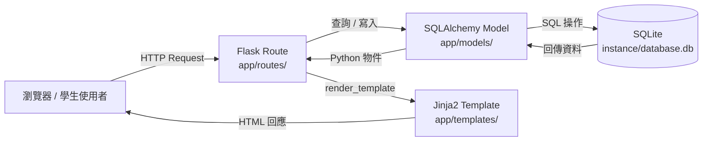
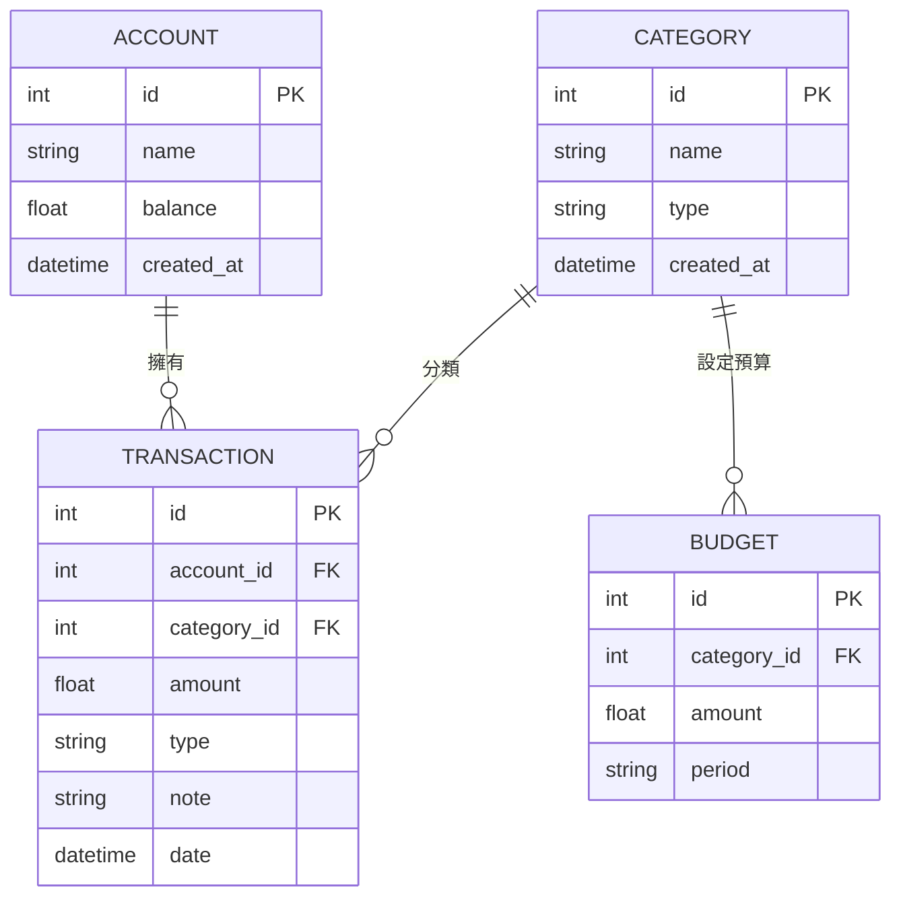

# 系統架構文件 - 個人記帳簿系統（學生版）

## 1. 技術架構說明

### 選用技術與原因

| 技術 | 角色 | 選用原因 |
|------|------|----------|
| **Python + Flask** | 後端 Web 框架 | 輕量易學，路由設計直觀，適合初學者快速上手 |
| **Jinja2** | 模板引擎（View） | Flask 原生整合，語法類似 Python，讓 HTML 可嵌入動態資料 |
| **SQLite** | 資料庫 | 零安裝、單一 `.db` 檔案，學生本機即可運行，不需架設伺服器 |
| **SQLAlchemy** | ORM 工具 | 以 Python 物件操作資料庫，減少手寫 SQL 的錯誤風險 |
| **Bootstrap 5** | 前端樣式框架 | 提供現成的 UI 元件，讓學生不必花太多時間在 CSS 上 |

### Flask MVC 模式說明

本專案採用 **MVC（Model-View-Controller）** 架構模式：

| 層次 | 對應元件 | 職責 |
|------|----------|------|
| **Model** | `app/models/` | 定義資料結構（帳戶、分類、交易、預算），負責與 SQLite 資料庫溝通 |
| **View** | `app/templates/` | Jinja2 HTML 模板，負責將資料呈現給使用者 |
| **Controller** | `app/routes/` | Flask 路由（Blueprint），接收 HTTP Request，呼叫 Model 取得資料，再回傳 View |

---

## 2. 專案資料夾結構

```
personal_bookkeeping/           ← 專案根目錄
│
├── app/                        ← 主要應用程式套件
│   ├── __init__.py             ← 建立 Flask app 實例，初始化 SQLAlchemy，註冊 Blueprint
│   │
│   ├── models/                 ← Model 層：SQLAlchemy 資料庫模型
│   │   ├── __init__.py         ← 匯出所有 Model
│   │   ├── account.py          ← 帳戶模型（現金、銀行、行動支付）
│   │   ├── category.py         ← 收支分類模型
│   │   ├── transaction.py      ← 交易紀錄模型（收入/支出）
│   │   └── budget.py           ← 月度預算模型
│   │
│   ├── routes/                 ← Controller 層：Flask Blueprint 路由
│   │   ├── __init__.py         ← 匯出所有 Blueprint
│   │   ├── main.py             ← 儀表板首頁、CSV 匯出
│   │   ├── transactions.py     ← 交易紀錄 CRUD
│   │   ├── accounts.py         ← 帳戶管理 CRUD
│   │   ├── categories.py       ← 分類管理
│   │   └── budgets.py          ← 預算設定與進度
│   │
│   ├── templates/              ← View 層：Jinja2 HTML 模板
│   │   ├── base.html           ← 共用版型（導覽列、頁尾、Flash 訊息）
│   │   ├── index.html          ← 儀表板首頁（收支統計卡片、最近交易）
│   │   ├── transactions/
│   │   │   ├── index.html      ← 交易列表（含篩選功能）
│   │   │   └── form.html       ← 新增/編輯交易表單
│   │   ├── accounts/
│   │   │   ├── index.html      ← 帳戶列表
│   │   │   └── form.html       ← 新增/編輯帳戶表單
│   │   ├── categories/
│   │   │   └── index.html      ← 分類管理頁面
│   │   └── budgets/
│   │       └── index.html      ← 預算進度頁面
│   │
│   └── static/                 ← 靜態資源
│       ├── css/
│       │   └── style.css       ← 自訂樣式（覆蓋 Bootstrap 預設值）
│       └── js/
│           └── main.js         ← 前端互動（如圖表初始化）
│
├── instance/
│   └── database.db             ← SQLite 資料庫（執行後自動產生，已加入 .gitignore）
│
├── docs/                       ← 專案文件
│   ├── PRD.md
│   ├── ARCHITECTURE.md         ← 本文件
│   ├── FLOWCHART.md
│   ├── DB_DESIGN.md
│   └── ROUTES.md
│
├── database/
│   └── schema.sql              ← SQLite 建表語法（備份用）
│
├── init_db.py                  ← 資料庫初始化腳本（含預設資料）
├── app.py                      ← 入口：建立並啟動 Flask 應用
├── requirements.txt            ← Python 套件清單
├── .env.example                ← 環境變數範例（SECRET_KEY 等）
└── .gitignore                  ← 排除 instance/、.env 等敏感檔案
```

---

## 3. 元件關係圖

### 請求／回應流程



### 資料模型關聯



---

## 4. 關鍵設計決策

### 決策 1：不採用前後端分離
- **做法**：頁面由 Flask + Jinja2 在伺服器端渲染，回傳完整 HTML。
- **原因**：學生專案不需要學習 REST API 與 JavaScript 框架，降低學習曲線，讓重點放在 Flask 與資料庫邏輯上。

### 決策 2：使用 Flask Blueprint 組織路由
- **做法**：依功能模組拆分為 `main.py`、`transactions.py`、`accounts.py` 等 Blueprint。
- **原因**：避免所有路由集中在單一檔案，結構清晰，未來新增功能（如統計圖表）只需新增一個 Blueprint 檔案。

### 決策 3：Transaction 自動連動帳戶餘額
- **做法**：在 `Transaction.create()` 與 `Transaction.delete()` 時，自動加減對應 Account 的 balance 欄位。
- **原因**：確保資料一致性，學生無需手動維護餘額，降低操作錯誤機率。

### 決策 4：使用 `base.html` 共用版型
- **做法**：所有頁面繼承 `base.html`，透過 Jinja2 的 `` 機制填入各頁內容。
- **原因**：導覽列、頁尾、Flash 訊息只需維護一份，修改一處即全站生效。

### 決策 5：SQLite 資料庫放置於 `instance/`
- **做法**：資料庫檔案 `database.db` 存放於 Flask 的 `instance/` 資料夾，並加入 `.gitignore`。
- **原因**：避免將個人財務資料上傳至 GitHub，保障隱私與資料安全。

---
*此文件以繁體中文撰寫，適合初學者閱讀。版本：v1.0 | 日期：2026-04-28*
