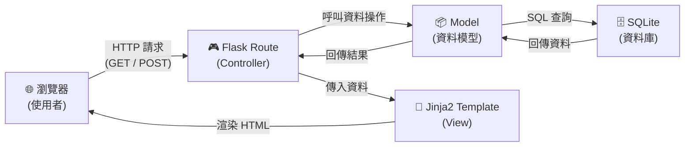
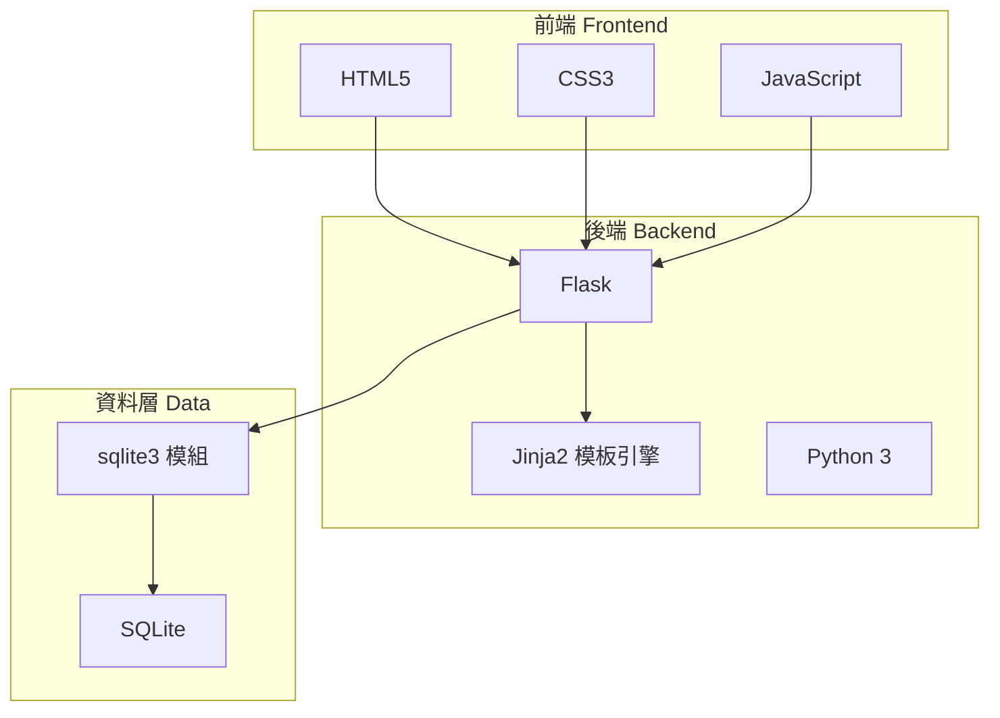

# 系統架構文件 — 食譜收藏夾

本文件根據 [PRD](./PRD.md) 的功能需求，規劃「食譜收藏夾」專案的技術架構、資料夾結構與各元件職責。

---

## 1. 技術架構說明

### 1.1 選用技術與原因

| 技術 | 用途 | 選用原因 |
| --- | --- | --- |
| **Python 3** | 程式語言 | 語法簡潔、社群資源豐富，適合快速開發 Web 應用。 |
| **Flask** | 後端框架 | 輕量、彈性高，適合中小型專案；學習曲線較 Django 平緩。 |
| **Jinja2** | 模板引擎 | Flask 內建支援，可在 HTML 中嵌入 Python 變數與邏輯，實現伺服器端渲染 (SSR)。 |
| **SQLite** | 資料庫 | 不需額外安裝資料庫伺服器，單一檔案即可運作，適合本地開發與小型部署。 |
| **HTML / CSS / JS** | 前端 | 原生技術，無需額外框架，降低複雜度。 |

### 1.2 Flask MVC 模式說明

本專案採用 **MVC（Model–View–Controller）** 架構模式來組織程式碼，讓職責分離、易於維護：

```
┌─────────────────────────────────────────────────────┐
│                     MVC 架構                         │
├─────────────┬─────────────────┬─────────────────────┤
│   Model     │   View          │   Controller        │
│  (模型層)    │  (視圖層)        │  (控制層)            │
├─────────────┼─────────────────┼─────────────────────┤
│ 定義資料結構  │ 負責畫面呈現     │ 接收請求、處理邏輯   │
│ 與資料庫互動  │ Jinja2 HTML 模板 │ 呼叫 Model 取得資料  │
│             │                 │ 選擇 View 回傳結果   │
└─────────────┴─────────────────┴─────────────────────┘
```

- **Model（模型層）**：定義資料表結構（如食譜、材料、標籤），負責與 SQLite 資料庫的讀寫操作。
- **View（視圖層）**：即 Jinja2 模板，負責將資料渲染成使用者看到的 HTML 頁面。
- **Controller（控制層）**：即 Flask 路由（Route），接收瀏覽器的 HTTP 請求，呼叫 Model 取得或儲存資料，再將結果傳給 View 顯示。

---

## 2. 專案資料夾結構

```
web_app_development/
│
├── app.py                  ← 應用程式入口，啟動 Flask 伺服器
├── config.py               ← 設定檔（資料庫路徑、密鑰等）
├── requirements.txt        ← Python 套件相依清單
│
├── app/                    ← 主要應用程式套件
│   ├── __init__.py         ← Flask App 工廠函式（create_app）
│   │
│   ├── models/             ← Model 層：資料庫模型
│   │   ├── __init__.py
│   │   └── recipe.py       ← 食譜相關的資料模型與 DB 操作
│   │
│   ├── routes/             ← Controller 層：Flask 路由
│   │   ├── __init__.py
│   │   └── recipe.py       ← 食譜相關的路由（CRUD、搜尋）
│   │
│   ├── templates/          ← View 層：Jinja2 HTML 模板
│   │   ├── base.html       ← 共用版型（導覽列、頁尾、CSS/JS 引入）
│   │   ├── index.html      ← 首頁（食譜列表）
│   │   ├── recipe_detail.html  ← 食譜詳情頁
│   │   ├── recipe_form.html    ← 新增 / 編輯食譜表單
│   │   └── search.html     ← 食材搜尋結果頁
│   │
│   └── static/             ← 靜態資源
│       ├── css/
│       │   └── style.css   ← 全站樣式
│       ├── js/
│       │   └── main.js     ← 前端互動邏輯
│       └── images/         ← 圖片資源（如食譜封面）
│
├── instance/               ← Flask instance 資料夾（不進版控）
│   └── database.db         ← SQLite 資料庫檔案
│
└── docs/                   ← 專案文件
    ├── PRD.md              ← 產品需求文件
    └── ARCHITECTURE.md     ← 系統架構文件（本文件）
```

### 各資料夾 / 檔案說明

| 路徑 | 說明 |
| --- | --- |
| `app.py` | 應用程式入口，呼叫 `create_app()` 並啟動 Flask 開發伺服器。 |
| `config.py` | 集中管理設定值，例如 `SECRET_KEY`、`DATABASE` 路徑等。 |
| `requirements.txt` | 列出所有 Python 相依套件（如 `Flask`），方便 `pip install -r` 安裝。 |
| `app/__init__.py` | 定義 Flask 應用程式工廠函式 `create_app()`，負責初始化 App、註冊路由藍圖（Blueprint）、設定資料庫。 |
| `app/models/` | 存放與資料庫互動的程式碼，每個檔案對應一組資料表的操作邏輯。 |
| `app/routes/` | 存放 Flask 路由（Blueprint），依功能模組拆分，每個檔案處理一組相關的 URL。 |
| `app/templates/` | 存放 Jinja2 HTML 模板，`base.html` 為共用版型，其餘頁面透過 `` 繼承。 |
| `app/static/` | 存放 CSS、JavaScript、圖片等靜態檔案，Flask 會自動提供靜態檔服務。 |
| `instance/` | Flask 的 instance 資料夾，存放不應進入版控的檔案（如 SQLite 資料庫）。 |

---

## 3. 元件關係圖

以下使用 Mermaid 語法呈現系統元件之間的互動關係：



### 請求處理流程

```
使用者操作（點擊、送出表單）
        │
        ▼
  ┌─────────────┐
  │  瀏覽器發送   │
  │  HTTP 請求    │
  └──────┬──────┘
         │
         ▼
  ┌─────────────┐
  │ Flask Route  │  ← Controller：解析 URL、處理邏輯
  │ (routes/)    │
  └──────┬──────┘
         │
    ┌────┴────┐
    │         │
    ▼         ▼
┌───────┐  ┌──────────┐
│ Model │  │ Jinja2   │
│ 讀寫DB │  │ 渲染 HTML │
└───┬───┘  └────┬─────┘
    │           │
    ▼           ▼
┌───────┐  ┌──────────┐
│SQLite │  │ HTML 回應 │ → 回傳給瀏覽器
└───────┘  └──────────┘
```

---

## 4. 關鍵設計決策

### 決策 1：使用 Flask Application Factory 模式

**選擇**：採用 `create_app()` 工廠函式來建立 Flask 應用程式。

**原因**：
- 避免全域變數的循環引入問題。
- 方便日後為測試環境建立不同設定的 App 實例。
- Flask 官方推薦的最佳實踐。

---

### 決策 2：使用 Blueprint 拆分路由

**選擇**：將路由放在 `app/routes/` 下，以 Flask Blueprint 方式註冊。

**原因**：
- 隨著功能增加（食譜 CRUD、搜尋、標籤管理），單一檔案會變得過於龐大。
- Blueprint 讓每個功能模組獨立管理路由，程式碼更清晰。
- 未來新增功能（如使用者登入）只需新增一個 Blueprint 檔案。

---

### 決策 3：SQLite 搭配原生 sqlite3 模組

**選擇**：使用 Python 內建的 `sqlite3` 模組直接操作資料庫，而非 ORM（如 SQLAlchemy）。

**原因**：
- 專案規模較小，ORM 帶來的抽象反而增加學習負擔。
- 直接撰寫 SQL 有助於初學者理解資料庫操作原理。
- 若日後需要升級至 SQLAlchemy，可以在不改變資料夾結構的前提下替換。

---

### 決策 4：模板繼承減少重複程式碼

**選擇**：建立 `base.html` 作為共用版型，其餘頁面透過 Jinja2 的 `` 繼承。

**原因**：
- 導覽列、頁尾、CSS/JS 引入只需寫一次。
- 修改共用元素時只需更新 `base.html`，所有頁面同步更新。
- 保持模板 DRY（Don't Repeat Yourself）。

---

### 決策 5：靜態資源集中管理

**選擇**：所有 CSS、JavaScript、圖片統一放在 `app/static/` 下，並依類型分子資料夾。

**原因**：
- Flask 內建 `static` 資料夾的路由支援，可直接透過 `url_for('static', filename='...')` 引用。
- 集中管理有助於日後加入打包工具或 CDN 部署。
- 清楚的分類讓團隊成員能快速找到對應檔案。

---

## 附錄：技術堆疊總覽


