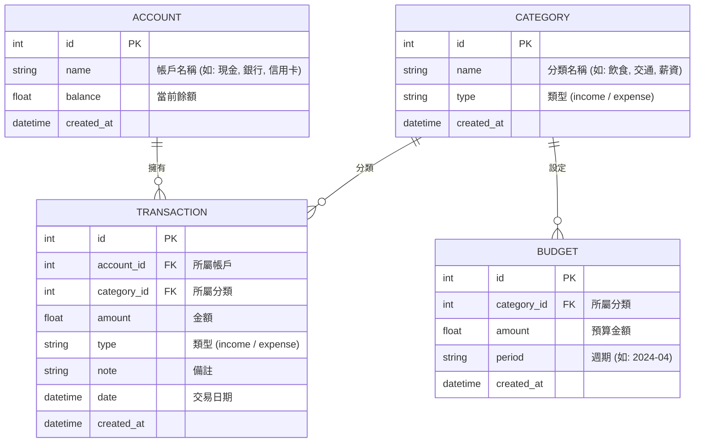

# 資料庫設計文件 - 個人記帳簿系統

## 1. ER 圖（實體關係圖）

## 2. 資料表詳細說明

### Account (帳戶表)
- `id`: INTEGER, PRIMARY KEY, AUTOINCREMENT
- `name`: TEXT, NOT NULL (帳戶名稱)
- `balance`: REAL, DEFAULT 0.0 (餘額)
- `created_at`: DATETIME, DEFAULT CURRENT_TIMESTAMP

### Category (分類表)
- `id`: INTEGER, PRIMARY KEY, AUTOINCREMENT
- `name`: TEXT, NOT NULL (分類名稱)
- `type`: TEXT, NOT NULL (類型: income 或 expense)
- `created_at`: DATETIME, DEFAULT CURRENT_TIMESTAMP

### Transaction (交易表)
- `id`: INTEGER, PRIMARY KEY, AUTOINCREMENT
- `account_id`: INTEGER, FOREIGN KEY REFERENCES Account(id)
- `category_id`: INTEGER, FOREIGN KEY REFERENCES Category(id)
- `amount`: REAL, NOT NULL (金額)
- `type`: TEXT, NOT NULL (類型: income 或 expense)
- `note`: TEXT (備註)
- `date`: DATETIME, NOT NULL (交易日期)
- `created_at`: DATETIME, DEFAULT CURRENT_TIMESTAMP

### Budget (預算表)
- `id`: INTEGER, PRIMARY KEY, AUTOINCREMENT
- `category_id`: INTEGER, FOREIGN KEY REFERENCES Category(id)
- `amount`: REAL, NOT NULL (預算金額)
- `period`: TEXT, NOT NULL (預算週期，格式如 YYYY-MM)
- `created_at`: DATETIME, DEFAULT CURRENT_TIMESTAMP

## 3. SQL 建表語法 (SQLite)
檔案儲存在 `database/schema.sql`。

## 4. Python Model 程式碼
使用 SQLAlchemy 實作，檔案儲存在 `app/models/` 目錄下：
- `app/models/account.py`
- `app/models/category.py`
- `app/models/transaction.py`
- `app/models/budget.py`
