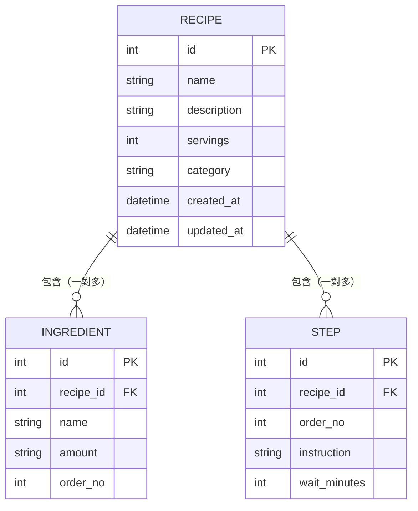

# 資料庫設計文件 - 食譜收藏夾

## 1. ER 圖（實體關係圖）

---

## 2. 資料表詳細說明

### 2-1. `recipes`（食譜）

| 欄位名稱 | 型別 | 必填 | 說明 |
|----------|------|------|------|
| `id` | INTEGER | ✅ | 主鍵，自動遞增 |
| `name` | TEXT | ✅ | 食譜名稱（例如：紅燒肉） |
| `description` | TEXT | ❌ | 食譜簡介或備註 |
| `servings` | INTEGER | ❌ | 幾人份（預設 2） |
| `category` | TEXT | ❌ | 分類標籤（例如：台式、甜點） |
| `created_at` | DATETIME | ✅ | 建立時間（自動填入） |
| `updated_at` | DATETIME | ✅ | 最後更新時間（自動填入） |

- **Primary Key**：`id`
- **關聯**：一筆 `recipe` 可對應多筆 `ingredients` 與 `steps`

---

### 2-2. `ingredients`（材料）

| 欄位名稱 | 型別 | 必填 | 說明 |
|----------|------|------|------|
| `id` | INTEGER | ✅ | 主鍵，自動遞增 |
| `recipe_id` | INTEGER | ✅ | 外鍵，對應 `recipes.id` |
| `name` | TEXT | ✅ | 材料名稱（例如：豬五花肉） |
| `amount` | TEXT | ❌ | 份量（例如：300g、2 大匙） |
| `order_no` | INTEGER | ✅ | 顯示順序（從 1 開始） |

- **Primary Key**：`id`
- **Foreign Key**：`recipe_id` → `recipes.id`（CASCADE DELETE）

---

### 2-3. `steps`（步驟）

| 欄位名稱 | 型別 | 必填 | 說明 |
|----------|------|------|------|
| `id` | INTEGER | ✅ | 主鍵，自動遞增 |
| `recipe_id` | INTEGER | ✅ | 外鍵，對應 `recipes.id` |
| `order_no` | INTEGER | ✅ | 步驟編號（從 1 開始） |
| `instruction` | TEXT | ✅ | 步驟說明文字 |
| `wait_minutes` | INTEGER | ❌ | 此步驟需要等待的分鐘數（0 表示不需要等待） |

- **Primary Key**：`id`
- **Foreign Key**：`recipe_id` → `recipes.id`（CASCADE DELETE）
- **核心功能**：`wait_minutes` 欄位對應 PRD 中「步驟所需等待時間」的差異化功能

---

## 3. SQL 建表語法

詳見 `database/schema.sql`。
