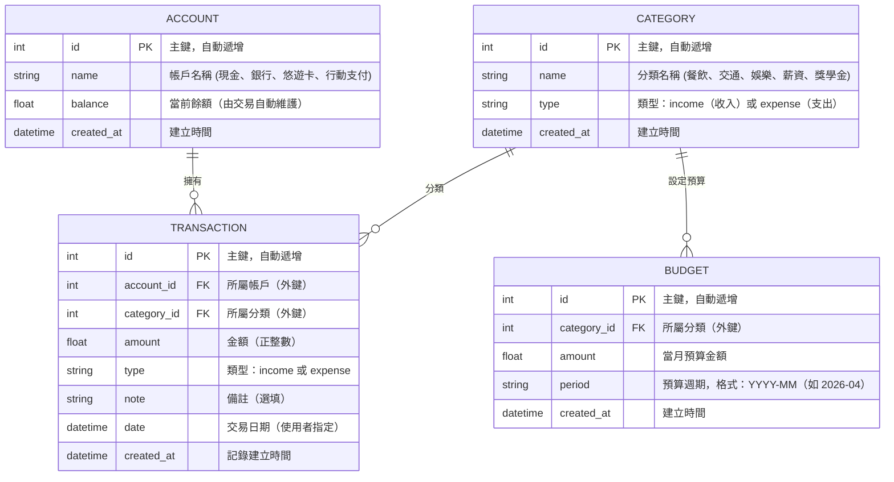

# 資料庫設計文件 - 個人記帳簿系統（學生版）

## 1. ER 圖（實體關係圖）

---

## 2. 資料表詳細說明

### Account（帳戶表）
| 欄位 | 型別 | 必填 | 說明 |
|------|------|------|------|
| `id` | INTEGER | ✅ | 主鍵，自動遞增 |
| `name` | TEXT(50) | ✅ | 帳戶名稱，如「現金錢包」、「玉山銀行」 |
| `balance` | REAL | ✅ | 當前餘額，由系統自動依交易增減，預設 0.0 |
| `created_at` | DATETIME | ✅ | 建立時間，預設 CURRENT_TIMESTAMP |

### Category（分類表）
| 欄位 | 型別 | 必填 | 說明 |
|------|------|------|------|
| `id` | INTEGER | ✅ | 主鍵，自動遞增 |
| `name` | TEXT(50) | ✅ | 分類名稱，如「餐飲」、「交通」、「薪資」 |
| `type` | TEXT(10) | ✅ | `income`（收入）或 `expense`（支出） |
| `created_at` | DATETIME | ✅ | 建立時間，預設 CURRENT_TIMESTAMP |

### Transaction（交易表）
| 欄位 | 型別 | 必填 | 說明 |
|------|------|------|------|
| `id` | INTEGER | ✅ | 主鍵，自動遞增 |
| `account_id` | INTEGER | ✅ | FK → account.id，所屬帳戶 |
| `category_id` | INTEGER | ✅ | FK → category.id，所屬分類 |
| `amount` | REAL | ✅ | 金額，必須為正數 |
| `type` | TEXT(10) | ✅ | `income` 或 `expense` |
| `note` | TEXT | ❌ | 備註，選填 |
| `date` | DATETIME | ✅ | 交易日期（使用者填寫） |
| `created_at` | DATETIME | ✅ | 建立時間，預設 CURRENT_TIMESTAMP |

### Budget（預算表）
| 欄位 | 型別 | 必填 | 說明 |
|------|------|------|------|
| `id` | INTEGER | ✅ | 主鍵，自動遞增 |
| `category_id` | INTEGER | ✅ | FK → category.id，所屬分類 |
| `amount` | REAL | ✅ | 月度預算金額 |
| `period` | TEXT(7) | ✅ | 預算週期，格式 YYYY-MM（如 `2026-04`） |
| `created_at` | DATETIME | ✅ | 建立時間，預設 CURRENT_TIMESTAMP |

---

## 3. SQL 建表語法（SQLite）

完整語法儲存於 `database/schema.sql`。

---

## 4. Python Model 程式碼

使用 SQLAlchemy ORM，各 Model 位於 `app/models/`：

| 檔案 | Model 類別 | 對應資料表 |
|------|-----------|-----------|
| `account.py` | `Account` | `account` |
| `category.py` | `Category` | `category` |
| `transaction.py` | `Transaction` | `transaction` |
| `budget.py` | `Budget` | `budget` |
| `__init__.py` | — | 匯出所有 Model |

每個 Model 包含：`create()`, `get_all()`, `get_by_id()`, `update()`, `delete()` 方法，以及完整的 `try/except` 錯誤處理。
