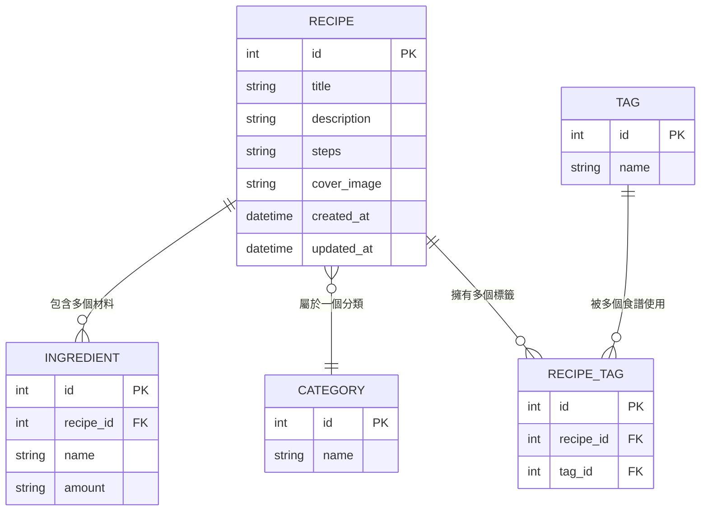

# 資料庫設計文件 — 食譜收藏夾

本文件根據 [PRD](./PRD.md) 與 [FLOWCHART](./FLOWCHART.md)，設計食譜收藏夾系統的資料庫結構。

---

## 1. ER 圖（實體關係圖）

### 關聯說明

| 關聯 | 類型 | 說明 |
| --- | --- | --- |
| RECIPE → INGREDIENT | 一對多 | 一道食譜包含多種材料 |
| RECIPE → CATEGORY | 多對一 | 每道食譜屬於一個分類（如：中式、甜點） |
| RECIPE ↔ TAG | 多對多 | 一道食譜可有多個標籤，一個標籤可用於多道食譜（透過 RECIPE_TAG 關聯表） |

---

## 2. 資料表詳細說明

### 2.1 RECIPE（食譜）

主要資料表，儲存每道食譜的基本資訊。

| 欄位 | 型別 | 必填 | 說明 |
| --- | --- | --- | --- |
| `id` | INTEGER | ✅ | 主鍵，自動遞增 (PK) |
| `title` | TEXT | ✅ | 食譜名稱 |
| `description` | TEXT | ❌ | 食譜簡介 |
| `steps` | TEXT | ✅ | 製作步驟（以換行分隔各步驟） |
| `cover_image` | TEXT | ❌ | 封面圖片檔名 |
| `category_id` | INTEGER | ❌ | 所屬分類 (FK → CATEGORY.id) |
| `created_at` | TEXT | ✅ | 建立時間（ISO 8601 格式） |
| `updated_at` | TEXT | ✅ | 更新時間（ISO 8601 格式） |

### 2.2 INGREDIENT（材料）

儲存每道食譜所需的材料項目。

| 欄位 | 型別 | 必填 | 說明 |
| --- | --- | --- | --- |
| `id` | INTEGER | ✅ | 主鍵，自動遞增 (PK) |
| `recipe_id` | INTEGER | ✅ | 所屬食譜 (FK → RECIPE.id) |
| `name` | TEXT | ✅ | 材料名稱（如：雞胸肉） |
| `amount` | TEXT | ❌ | 用量（如：200g、2大匙） |

### 2.3 CATEGORY（分類）

食譜的分類選項（如：中式、西式、甜點、快速料理等）。

| 欄位 | 型別 | 必填 | 說明 |
| --- | --- | --- | --- |
| `id` | INTEGER | ✅ | 主鍵，自動遞增 (PK) |
| `name` | TEXT | ✅ | 分類名稱（唯一） |

### 2.4 TAG（標籤）

可自由新增的標籤（如：低卡、素食、15分鐘上菜）。

| 欄位 | 型別 | 必填 | 說明 |
| --- | --- | --- | --- |
| `id` | INTEGER | ✅ | 主鍵，自動遞增 (PK) |
| `name` | TEXT | ✅ | 標籤名稱（唯一） |

### 2.5 RECIPE_TAG（食譜—標籤關聯表）

多對多關聯表，連結食譜與標籤。

| 欄位 | 型別 | 必填 | 說明 |
| --- | --- | --- | --- |
| `id` | INTEGER | ✅ | 主鍵，自動遞增 (PK) |
| `recipe_id` | INTEGER | ✅ | 食譜 ID (FK → RECIPE.id) |
| `tag_id` | INTEGER | ✅ | 標籤 ID (FK → TAG.id) |

---

## 3. SQL 建表語法

完整的 SQL 建表語法請參考 [database/schema.sql](../database/schema.sql)。
