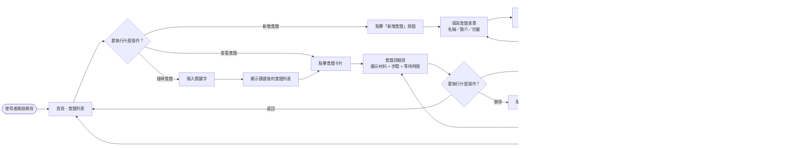
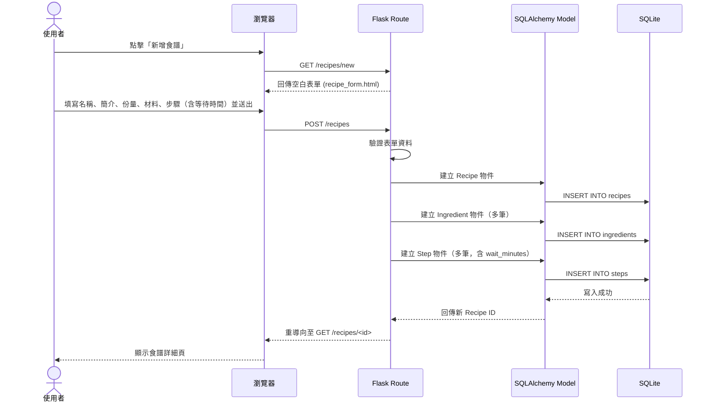
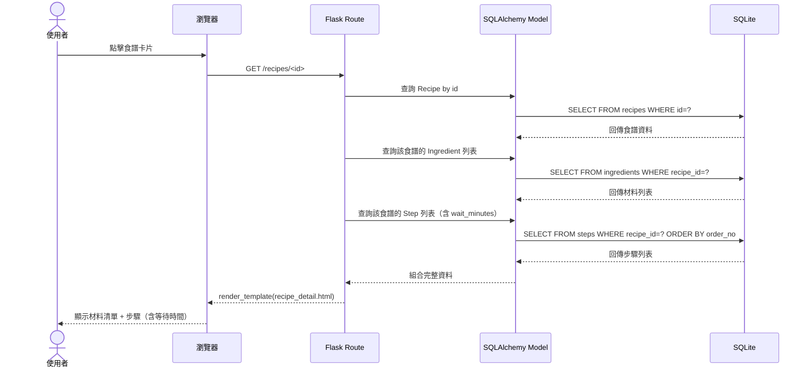
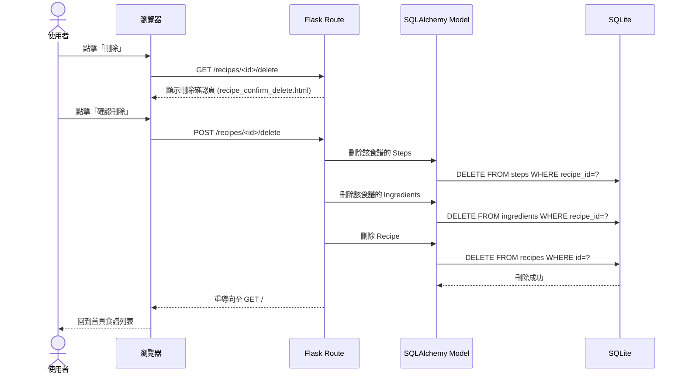

# 流程圖文件 - 食譜收藏夾

## 1. 使用者流程圖（User Flow）

描述使用者從進入網站到完成各項操作的路徑。

---

## 2. 系統序列圖（Sequence Diagram）

描述各主要操作的資料流，從使用者點擊到資料庫寫入的完整流程。

### 2-1. 新增食譜

### 2-2. 查看食譜詳細頁

### 2-3. 刪除食譜

---

## 3. 功能清單對照表

| 功能 | URL 路徑 | HTTP 方法 | 對應模板 | 說明 |
|------|----------|-----------|----------|------|
| 首頁 / 食譜列表 | `/` | GET | `index.html` | 顯示所有食譜卡片 |
| 食譜詳細頁 | `/recipes/<id>` | GET | `recipe_detail.html` | 顯示材料、步驟與等待時間 |
| 顯示新增表單 | `/recipes/new` | GET | `recipe_form.html` | 空白表單 |
| 送出新增表單 | `/recipes` | POST | — | 寫入資料庫後重導向 |
| 顯示編輯表單 | `/recipes/<id>/edit` | GET | `recipe_form.html` | 預填現有資料的表單 |
| 送出編輯表單 | `/recipes/<id>/edit` | POST | — | 更新資料庫後重導向 |
| 刪除確認頁 | `/recipes/<id>/delete` | GET | `recipe_confirm_delete.html` | 顯示確認訊息 |
| 執行刪除 | `/recipes/<id>/delete` | POST | — | 刪除資料後重導向至首頁 |
| 搜尋食譜 | `/recipes/search?q=` | GET | `index.html` | 依關鍵字篩選食譜 |
