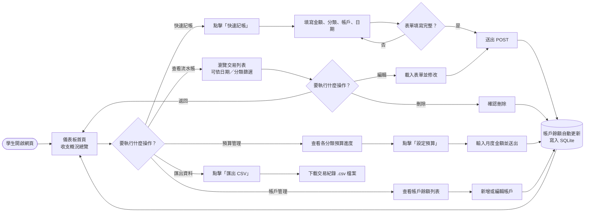
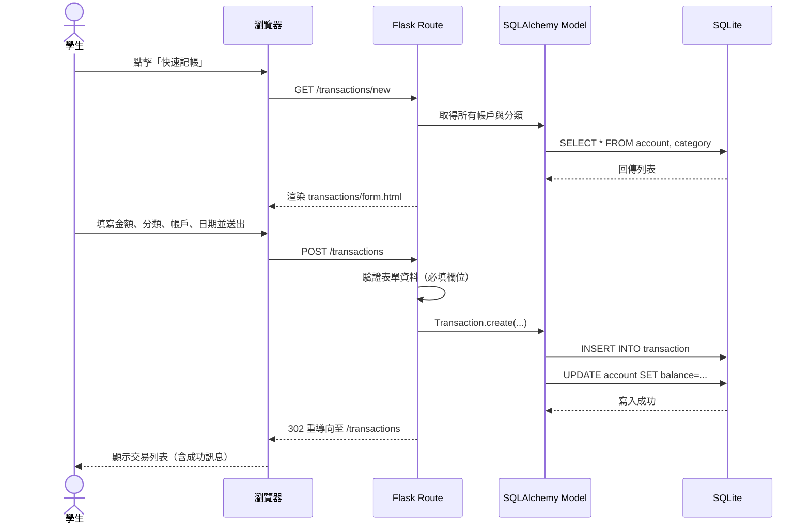
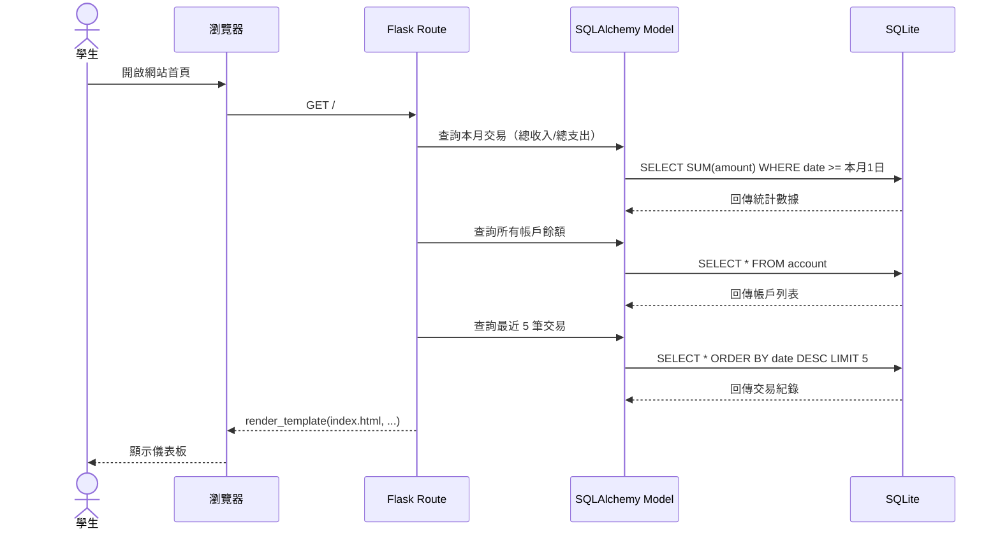
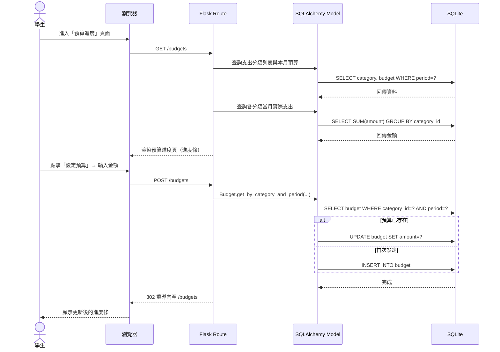

# 流程圖文件 - 個人記帳簿系統（學生版）

## 1. 使用者流程圖（User Flow）

描述學生從進入網站到完成各項操作的路徑。

---

## 2. 系統序列圖（Sequence Diagram）

### 2-1. 新增交易（記帳）

### 2-2. 查看儀表板

### 2-3. 設定月度預算

---

## 3. 功能清單對照表

| 功能 | URL 路徑 | HTTP 方法 | 對應模板 | 說明 |
|------|----------|-----------|----------|------|
| 儀表板首頁 | `/` | GET | `index.html` | 收支總覽、最近交易、帳戶餘額 |
| 交易列表 | `/transactions` | GET | `transactions/index.html` | 全部交易，支援篩選 |
| 新增交易表單 | `/transactions/new` | GET | `transactions/form.html` | 空白記帳表單 |
| 建立交易 | `/transactions` | POST | — | 寫入 DB 並更新餘額，重導向 |
| 編輯交易表單 | `/transactions/<id>/edit` | GET | `transactions/form.html` | 預填現有資料 |
| 更新交易 | `/transactions/<id>/update` | POST | — | 更新 DB 後重導向 |
| 刪除交易 | `/transactions/<id>/delete` | POST | — | 刪除並回滾餘額，重導向 |
| 帳戶列表 | `/accounts` | GET | `accounts/index.html` | 帳戶名稱與餘額 |
| 新增帳戶 | `/accounts/new` | GET | `accounts/form.html` | 填寫帳戶名稱與初始金額 |
| 建立帳戶 | `/accounts` | POST | — | 寫入 DB，重導向 |
| 分類管理 | `/categories` | GET | `categories/index.html` | 查看＋快速新增分類 |
| 新增分類 | `/categories` | POST | — | 寫入 DB，重導向 |
| 預算進度 | `/budgets` | GET | `budgets/index.html` | 各分類進度條 |
| 設定預算 | `/budgets` | POST | — | 新增或更新預算，重導向 |
| 匯出 CSV | `/export/csv` | GET | — | 下載全部交易紀錄 CSV |
