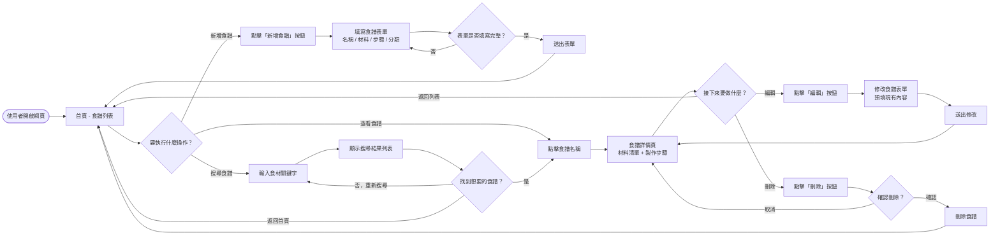
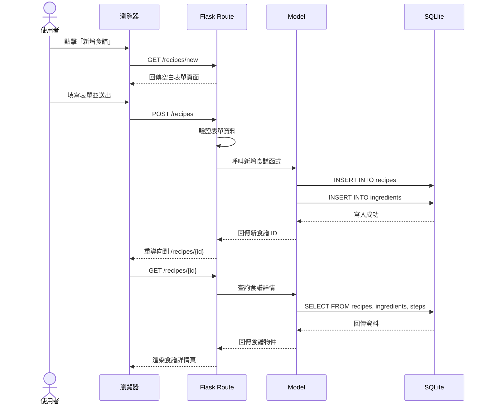
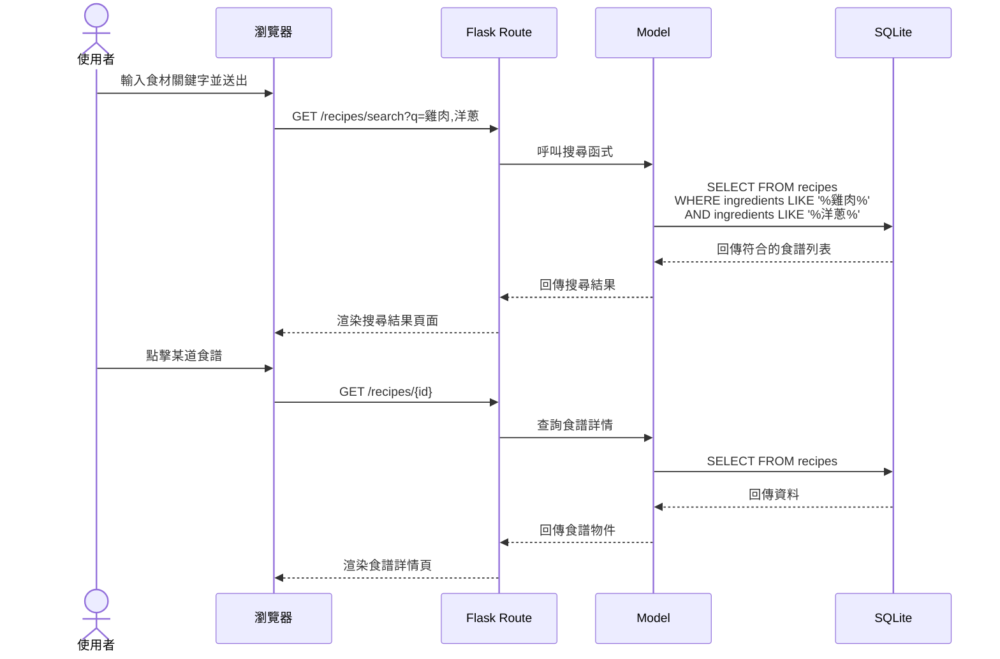
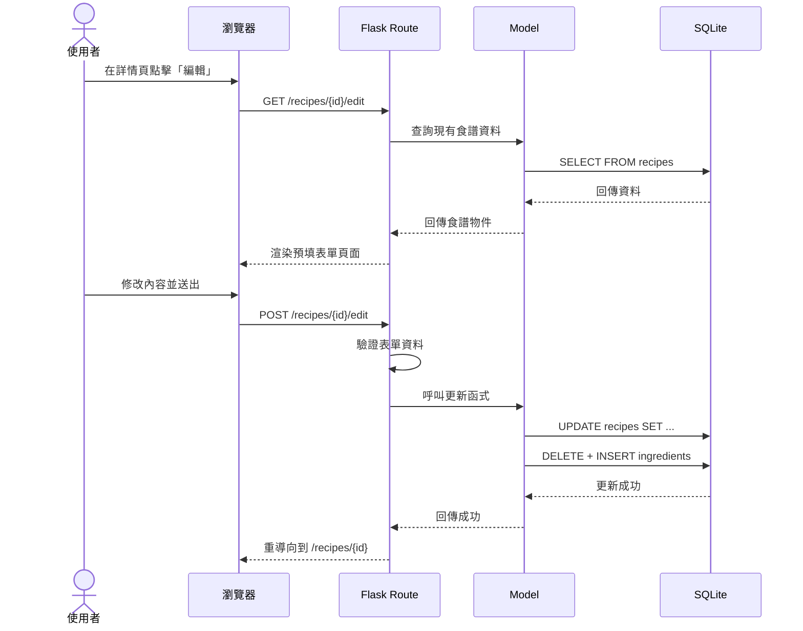
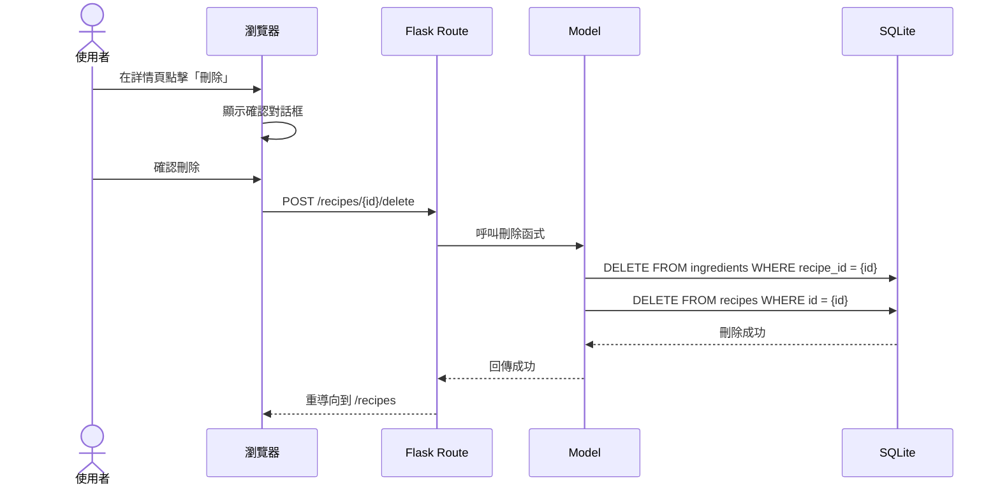

# 流程圖文件 — 食譜收藏夾

本文件根據 [PRD](./PRD.md) 與 [ARCHITECTURE](./ARCHITECTURE.md)，以 Mermaid 語法呈現使用者操作流程與系統內部資料流。

---

## 1. 使用者流程圖（User Flow）

以下流程圖描述使用者從進入網站到完成各項操作的完整路徑：

### 流程說明

- **新增食譜**：使用者從首頁點擊「新增食譜」→ 填寫表單 → 送出後回到首頁。
- **查看食譜**：使用者在首頁點擊食譜名稱 → 進入詳情頁，可查看材料與步驟。
- **編輯食譜**：從詳情頁點擊「編輯」→ 修改表單內容 → 送出後回到詳情頁。
- **刪除食譜**：從詳情頁點擊「刪除」→ 確認後刪除並回到首頁。
- **搜尋食譜**：使用者輸入食材關鍵字 → 系統列出包含該食材的食譜 → 可點擊查看詳情。

---

## 2. 系統序列圖（Sequence Diagram）

### 2.1 新增食譜

### 2.2 根據食材搜尋食譜

### 2.3 編輯食譜

### 2.4 刪除食譜

---

## 3. 功能清單對照表

下表列出每個功能對應的 URL 路徑、HTTP 方法與簡要說明：

| 功能 | URL 路徑 | HTTP 方法 | 說明 |
| --- | --- | --- | --- |
| 首頁（食譜列表） | `/` 或 `/recipes` | GET | 顯示所有食譜的列表，支援分類篩選 |
| 新增食譜（表單） | `/recipes/new` | GET | 顯示空白的食譜新增表單 |
| 新增食譜（送出） | `/recipes` | POST | 接收表單資料，建立新食譜並存入資料庫 |
| 食譜詳情 | `/recipes/<id>` | GET | 顯示單一食譜的完整內容（材料、步驟） |
| 編輯食譜（表單） | `/recipes/<id>/edit` | GET | 顯示預填現有資料的編輯表單 |
| 編輯食譜（送出） | `/recipes/<id>/edit` | POST | 接收修改後的資料，更新資料庫 |
| 刪除食譜 | `/recipes/<id>/delete` | POST | 刪除指定食譜及其關聯資料 |
| 搜尋食譜 | `/recipes/search` | GET | 根據食材關鍵字查詢符合的食譜 |
