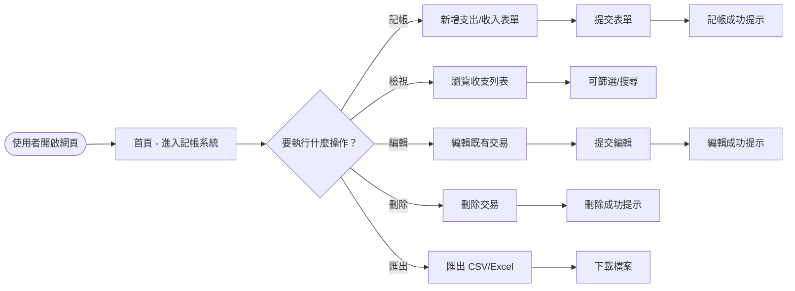
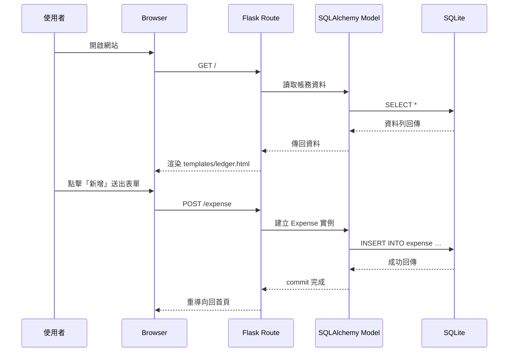

# FLOWCHART - 個人記帳簿系統

本文件使用 Mermaid 語法呈現兩張圖：**使用者流程圖** 與 **系統序列圖**，以及 **功能清單對照表**，說明系統的操作與資料流向。

---

## 1️⃣ 使用者流程圖（User Flow）

---

## 2️⃣ 系統序列圖（Sequence Diagram）

---

## 3️⃣ 功能清單對照表

| 功能 | URL 路徑 | HTTP 方法 | 說明 |
|------|----------|-----------|------|
| 記帳 | `/expense/add` | POST | 新增支出或收入項目 |
| 檢視列表 | `/` (首頁) | GET | 顯示所有帳務記錄，提供篩選、搜尋 |
| 編輯 | `/expense/edit/<id>` | POST | 更新既有交易資料 |
| 刪除 | `/expense/delete/<id>` | POST | 移除指定交易 |
| 匯出資料 | `/export` | GET | 產生 CSV/Excel 檔下載 |
